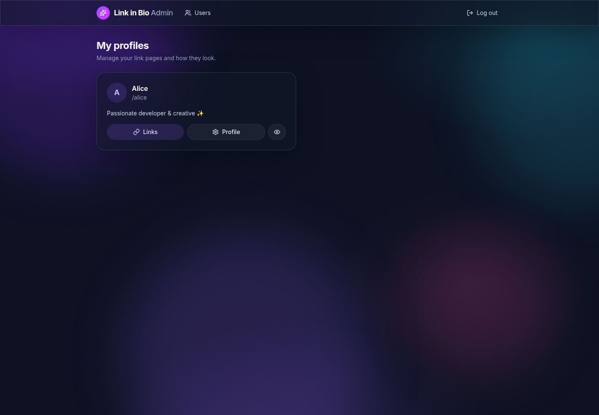
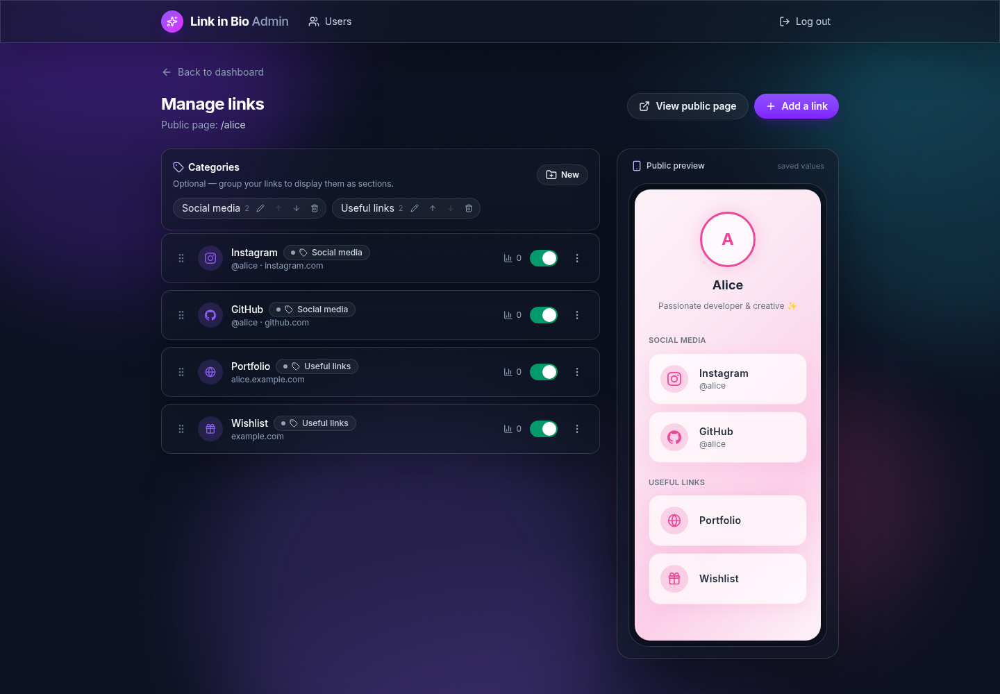
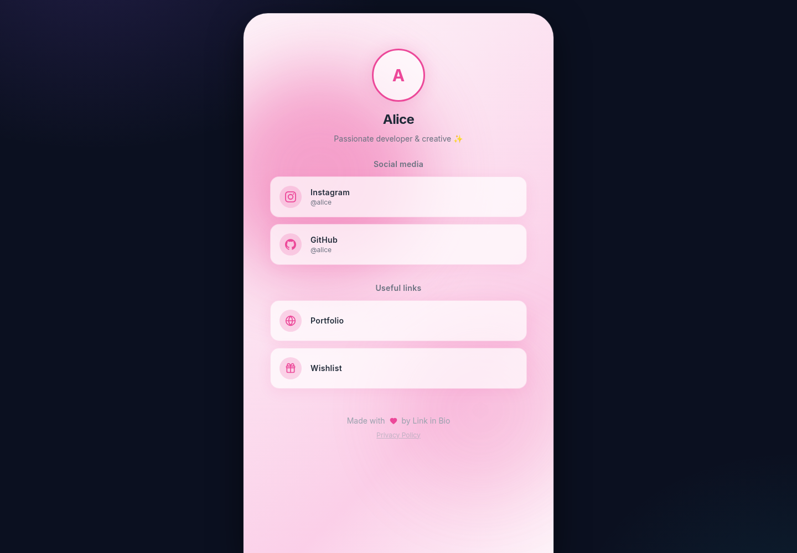

# 🌸 Link in Bio

A self-hosted link-in-bio web application. Each user gets a personalized public page with their links, categories, and visual theme — similar to Linktree, but fully open source and yours to deploy.

[](LICENSE)
[](backend/composer.json)
[](backend/composer.json)
[](frontend/package.json)
[](frontend/package.json)
[](frontend/package.json)
[](compose.yaml)
[](compose.yaml)

## Table of contents

- [Screenshots](#screenshots)
- [Features](#features)
- [Tech stack](#tech-stack)
- [Getting started](#getting-started)
  - [Docker](#getting-started-docker)
  - [Without Docker](#getting-started-without-docker)
- [Demo accounts](#demo-accounts-fixtures)
- [API routes](#api-routes)
  - [Public](#public)
  - [Admin (auth required)](#admin-auth-required)
- [Themes](#themes)
- [Customization](#customization)
- [Contributing](#contributing)
- [Technical notes](#technical-notes)
- [License](#license)

## Screenshots

| Admin dashboard | Link management |
|-----------------|-----------------|
|  |  |

| Public profile page |
|---------------------|
|  |

## Features

- **Public link pages** — each profile has its own public page with a slug (`/app/alice`) or its own subdomain (`alice.example.com`).
- **Admin interface** — create, edit, reorder, enable/disable, and delete links with drag & drop; organize them into categories; live phone-style preview.
- **Theming** — 5 built-in themes (Midnight, Blossom, Ocean, Golden Hour, Glass), custom background image, and per-profile overrides for text colors and fonts.
- **Social links** — 30+ built-in platforms with URL templates (Instagram, GitHub, TikTok, YouTube, OnlyFans, Throne, and more), or fully custom links with custom icons.
- **Click tracking** — each link counts its clicks, exposed in the admin interface.
- **User management** — administrators can create users, assign roles, and manage profiles.

## Tech stack

| Layer      | Technology                                            |
|------------|-------------------------------------------------------|
| Backend    | Symfony 8, Doctrine ORM, PHP 8.5                      |
| Frontend   | React 19, Vite, Tailwind CSS v4, Lucide Icons         |
| Database   | MySQL 8.4                                             |
| Auth       | Session cookie (`json_login`)                         |

## Project structure

```
link-in-bio/
├── backend/           # Symfony API
│   ├── migrations/    # Doctrine migrations (committed)
│   ├── src/           # Entities, Controllers/Api, Repositories, Commands
│   ├── public/        # Front controller + .htaccess + uploads/
│   └── .env.example   # Environment template
├── frontend/          # React SPA (Vite) → builds into backend/public/app/
├── docker/            # PHP Dockerfile + Apache vhost
├── compose.yaml       # Dev stack (php + mysql 8.4)
├── Makefile           # Convenience commands for Docker
├── docs/              # Design notes, screenshots
└── composer           # Versioned Composer binary (for hosts without Composer)
```

> The built frontend (`backend/public/app/`) is gitignored — run `npm run build` in `frontend/` to generate it.

## Getting started

### Getting started (Docker)

Prerequisites: Docker + Docker Compose.

```bash
make up            # starts php:8000 + mysql:3306
make composer      # composer install -d backend
make console cmd="doctrine:migrations:migrate --no-interaction"
make console cmd="doctrine:fixtures:load --no-interaction"

# Frontend (Node.js required on the host)
cd frontend && npm install && npm run dev   # dev server :5173 (proxies /api → :8000)
# or build the static frontend served by Apache at :8000/app/
cd frontend && npm run build
```

The API responds on http://localhost:8000/api and the built frontend on http://localhost:8000/app/.

#### Demo accounts (fixtures)

| Email                | Password     | Profile      | Theme  |
|----------------------|--------------|--------------|--------|
| `demo@example.com`   | `password123`| `/app/alice` | rose   |
| `demo2@example.com`  | `password123`| `/app/bob`   | ocean  |

### Getting started (without Docker)

PHP 8.5+ with `pdo_mysql`, MySQL 8.4, and Node.js 18+.

```bash
cd backend && composer install
cp .env.example .env.local   # then fill in DATABASE_URL
php bin/console doctrine:migrations:migrate --no-interaction
php bin/console doctrine:fixtures:load --no-interaction
php -S 127.0.0.1:8000 -t public

cd frontend && npm install && npm run dev
```

## API routes

### Public

| Method | Route                               | Description                          |
|--------|-------------------------------------|--------------------------------------|
| `GET`  | `/api/public`                       | List of public profiles              |
| `GET`  | `/api/public/{slug}`                | Profile + active links               |
| `POST` | `/api/public/{slug}/click/{linkId}` | Track a click                        |
| `GET`  | `/api/themes`                       | List available themes                |
| `GET`  | `/api/social-networks`              | List social networks (type + URL template) |

### Admin (auth required)

| Method   | Route                                            | Description          |
|----------|--------------------------------------------------|----------------------|
| `POST`   | `/api/login`                                     | Log in               |
| `POST`   | `/api/logout`                                    | Log out              |
| `GET`    | `/api/me`                                        | Current user         |
| `GET`    | `/api/admin/profiles`                            | My profiles          |
| `PUT`    | `/api/admin/profiles/{id}`                       | Update a profile     |
| `GET`    | `/api/admin/profiles/{pid}/links`                | List links           |
| `POST`   | `/api/admin/profiles/{pid}/links`                | Create a link        |
| `PUT`    | `/api/admin/profiles/{pid}/links/reorder`        | Reorder links        |
| `PUT`    | `/api/admin/profiles/{pid}/links/{id}`           | Update a link        |
| `DELETE` | `/api/admin/profiles/{pid}/links/{id}`           | Delete a link        |
| `GET`    | `/api/admin/profiles/{pid}/categories`           | List categories      |
| `POST`   | `/api/admin/profiles/{pid}/categories`           | Create a category    |
| `PUT`    | `/api/admin/profiles/{pid}/categories/reorder`   | Reorder categories   |
| `PUT`    | `/api/admin/profiles/{pid}/categories/{id}`      | Update a category    |
| `DELETE` | `/api/admin/profiles/{pid}/categories/{id}`      | Delete a category    |
| `GET`    | `/api/admin/users`                               | List users           |
| `POST`   | `/api/admin/users`                               | Create a user        |
| `PUT`    | `/api/admin/users/{id}`                          | Update a user        |
| `DELETE` | `/api/admin/users/{id}`                          | Delete a user        |
| `POST`   | `/api/uploads?type=avatars\|backgrounds\|icons`  | Upload an image      |

## Themes

5 predefined themes (`frontend/src/themes/` + the `/api/themes` endpoint):

| Name   | Label       | Vibe                              |
|--------|-------------|-----------------------------------|
| dark   | Midnight    | Dark, violet, glassmorphism       |
| rose   | Blossom     | Soft pastel pink                  |
| ocean  | Ocean       | Deep blue → cyan                  |
| sunset | Golden Hour | Warm orange/coral                 |
| glass  | Glass       | Frosted translucent surfaces      |

## Customization

- **Branding** — the UI title/description live in `frontend/index.html`; the brand name in the admin is in `frontend/src/components/AdminLayout.jsx`, the public home page in `frontend/src/pages/Home.jsx`, and the footer in `frontend/src/components/Footer.jsx`.
- **Subdomain mode** — set `APP_DOMAIN` in `frontend/src/App.jsx` and the `host: '{slug}.example.com'` requirement in `backend/src/Controller/ProfileSubdomainController.php` to your own domain. Profiles are then reachable at `alice.your-domain.com` with no extra configuration.
- **Privacy page** — replace the placeholder contact email in `frontend/src/pages/Privacy.jsx`.
- **Social platforms** — add or edit platforms in `backend/src/Service/SocialNetworkService.php` and `frontend/src/icons/index.js` (keep the icon names in sync).
- **Demo data** — the fixtures live in `backend/src/DataFixtures/AppFixtures.php`.

## Contributing

Contributions are welcome! Please open an issue or submit a pull request.

- Frontend lint: `cd frontend && npm run lint`
- Frontend build: `cd frontend && npm run build`
- Backend: install via Composer, run migrations, and make sure `php -l` passes on changed files.

## Technical notes

- `doctrine/orm` is pinned to `<3.6.8`: version 3.6.8 requires `doctrine/dbal ^4.5`, which was not yet released in stable. Move back to `^3.6` (or upgrade to DBAL 4.5) as soon as compatible.
- Migrations are generated with `doctrine:migrations:diff` and must be committed: the deploy process only runs `migrate`.

## License

[MIT](LICENSE)
